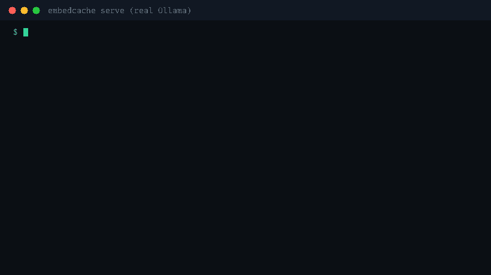
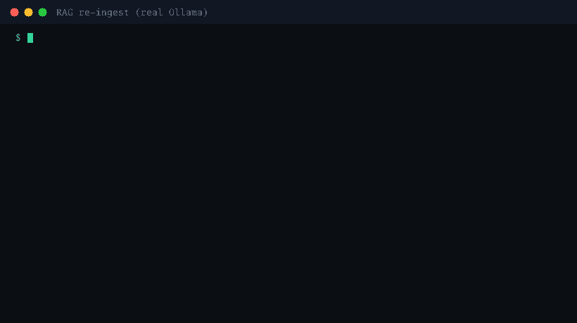
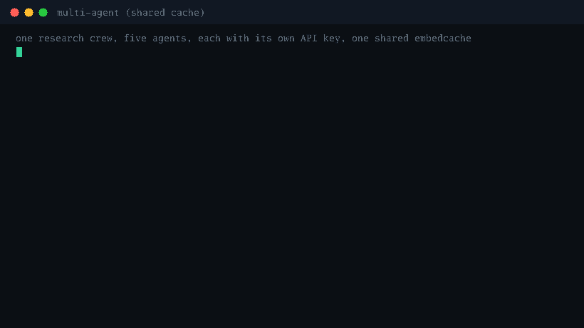
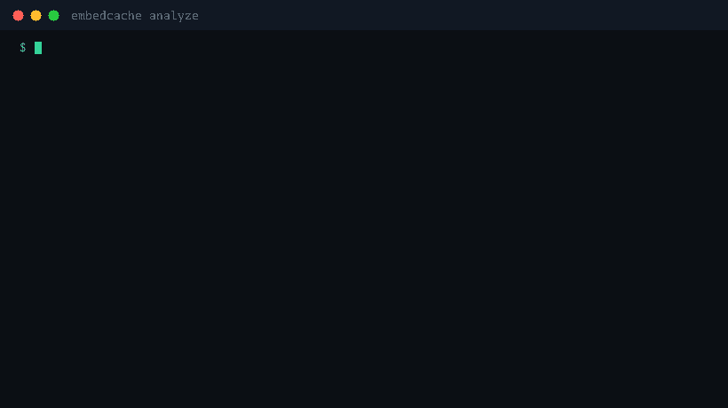

# embedcache

**[Website](https://ajay6601.github.io/embedcache/) · [Documentation](https://ajay6601.github.io/embedcache/docs.html) · [Examples](https://ajay6601.github.io/embedcache/examples.html)**



**The cost-control and dedupe layer for embedding APIs.** A single-binary proxy that sits in front of any OpenAI-compatible embedding backend - vLLM, Ollama, text-embeddings-inference, or api.openai.com - and eliminates duplicate work before it reaches your GPUs or your API bill. Then it hands you the invoice for what it saved.

```
your app ──► embedcache ──► vLLM / Ollama / TEI / OpenAI
                 │
                 ├─ exact-match cache (byte-exact replays, content-addressed)
                 ├─ in-flight coalescing (N concurrent identical calls → 1 upstream)
                 ├─ batch dedupe (only the uncached items go upstream)
                 └─ waste report ($X of your embedding spend was duplicates)
```

Zero dependencies - pure Go stdlib. One static binary. No Python runtime, no Redis required, no framework lock-in.

## What it's for

You run embedcache as a service (like nginx or Redis - not a library you import), point your apps' `base_url` at it, and it does four jobs across every language and team sharing it:

1. **Measure** - `embedcache analyze` reads your existing request logs and tells you how much of your embedding spend is duplicate work, before you install anything.
2. **Reduce** - an exact-match cache, in-flight coalescing, batch dedupe, and a content-defined chunk-diff engine eliminate that duplicate work in the request path.
3. **Enforce** - per-key/per-tenant token budgets stop runaway agents from burning the backend, while cache hits keep serving.
4. **Account** - live per-model and per-caller spend/savings on `/_ec/stats`, `/metrics` (Prometheus), and a human `report`.

Typical users: platform/ML-infra teams past ~10M embedding tokens/day running vLLM/Ollama plus an API fallback; RAG and agent teams re-embedding corpora and burning tokens in loops.

## See it running

Every clip below is a real capture: the commands actually ran, against real backends, and the statuses, latencies, and numbers on screen are what the live proxy returned (recorded by `experiments/gifcap`, rendered by `tools/termgif`, transcripts under `experiments/gifcap/samples/`). The one at the top is embedcache in front of real Ollama, serving a real miss then a real hit.

**RAG: a nightly re-ingest, nothing changed, so nothing is recomputed** ([REALTEST.md](REALTEST.md))



**Agents: two agents with different keys share one cache, and a capped agent is stopped mid-run** ([MULTIAGENT.md](MULTIAGENT.md))



**CLI: point the offline analyzer at a real request log and see your duplicate spend** ([the waste report](#the-waste-report))



## What's in v0.2.0

| Capability | What it does |
|---|---|
| Exact-match cache | Byte-exact replays, content-addressed by `model + dims + encoding + provider params + text` |
| In-flight coalescing | N concurrent identical requests → 1 upstream computation |
| Batch dedupe | Only never-seen items in a batch go upstream; correct index mapping |
| Chunk-diff engine | `embedcache chunk` (FastCDC) so a document edit only re-embeds the chunks it touched |
| Per-key budgets | Hard token limits per key/tenant; 429 on new spend, hits keep serving |
| Auth | Allowlist or upstream-verified client keys; admin-token-guarded endpoints |
| Resilience | Retries + circuit breaker; cache hits serve through upstream outages |
| Persistence | Snapshot survives restarts; TTL bounds staleness |
| Waste analytics | Offline analyzer + live `/_ec/stats`, `/metrics`, `report` |
| Onboarding | `embedcache demo` (zero-setup walkthrough) and `embedcache check` (backend probe + setup helper) |
| Providers | Ollama, vLLM, TEI, OpenAI, Gemini, Voyage, Mistral, Azure OpenAI |

## Why this exists

Embedding workloads are full of silent duplicate work: re-ingesting a corpus where 95% of chunks didn't change, hot queries embedded thousands of times, retry storms, multiple services embedding the same strings. Frameworks solve this *inside* Python (LangChain's RecordManager, LlamaIndex's IngestionPipeline) - useless if your pipeline is Go, TypeScript, custom, or split across teams. Gateways treat it as a checkbox: LiteLLM's embedding cache has a [known bug](https://github.com/BerriAI/litellm/issues/22659) where mixed cached/uncached batches can return wrong vectors.

## How much it saves (measured, not projected)

Every number below comes from a real run in this repo - the workloads and edits are real, the inference is real, the reports are regenerated by the code, not hand-written.

| On this workload | embedcache absorbed |
|---|---|
| A real RAG agent over 103 live Wikipedia articles, zero constructed duplicates | **49.7%** of embedding tokens were duplicate work ([REALTEST.md](REALTEST.md)) |
| A nightly re-ingest where 5% of a 10k-chunk corpus changed | **95.2%** of embedding calls absorbed ([EXPERIMENTS.md](EXPERIMENTS.md)) |
| Re-ingesting a real doc after one real single-sentence edit, with chunk-diff | **93.8%** hit rate vs **28.6%** for fixed-size chunking ([CHUNKDIFF.md](CHUNKDIFF.md)) |
| Search-shaped (Zipf) query traffic on a real corpus | **~80%** hit rate across six real models ([VALIDATION.md](VALIDATION.md)) |
| Re-running a full BEIR SciFact eval (300 queries × 5,183 docs) the second time | **100%** absorbed, ~2s instead of ~25min, at **zero** quality change ([BENCHMARKS.md](BENCHMARKS.md)) |

Your number depends on your traffic - which is exactly why `embedcache analyze` measures it on your own logs before you deploy anything.

## How it's tested

embedcache does one thing, language-agnostically, and provably correctly. Eight tiers of evidence live in the repo, each regenerated by code under `experiments/` and (the first) re-run by CI on every push:

| Report | What it proves | Data | Backend |
|---|---|---|---|
| [EXPERIMENTS.md](EXPERIMENTS.md) | correctness, coalescing, overhead, savings - the CI gate | deterministic | mock |
| [PRODSIM.md](PRODSIM.md) | scale: 50k-chunk ingest, 300k-request storm at 39k req/s, hostile traffic, crash recovery | synthetic corpus | real Ollama |
| [REALTEST.md](REALTEST.md) | a working RAG agent, organic dedup with zero constructed duplicates | **live Wikipedia + real LLM** | real Ollama |
| [CHUNKDIFF.md](CHUNKDIFF.md) | chunk-diff beats fixed-size chunking on a real edit | **live Wikipedia** | real Ollama |
| [VALIDATION.md](VALIDATION.md) | correctness + RAG + agentic + search + multilingual + long-context + budgets across **6 real models at 3 dims** | **this repo's Go source + live Wikipedia (en/zh/hi/ar/es)** | Ollama 384/768/1024-dim (+ Gemini 3072-dim when keyed) |
| [BENCHMARKS.md](BENCHMARKS.md) | **zero retrieval-quality loss** on a recognized IR benchmark + free eval re-runs | **BEIR SciFact: 5,183 real docs, 300 expert-judged queries** | real Ollama |
| [PERF.md](PERF.md) | honest open-loop (coordinated-omission-free) latency, p50→p99.9 | constant-rate load | real Ollama |
| [MULTIAGENT.md](MULTIAGENT.md) | cross-agent reuse, coalescing under concurrency, mid-run budget cap, **cross-language cache sharing** | **live Wikipedia + real LLM + real Python/LangChain** | real Ollama |

The multi-model suite deliberately surfaced real backend behaviors and shows embedcache handling each correctly rather than hiding them: Gemini is not bitwise-deterministic (embedcache stabilizes repeats to one vector), Gemini rate-limits under burst, small-context models reject oversized chunks, and the rough bytes/4 token estimator drifts on CJK/Arabic scripts (it only feeds the *analyzer's* estimate; billed spend is apportioned from the backend's exact reported total, never estimated). None of these are cache defects.

| Correctness claim | Evidence |
|---|---|
| Byte-exact responses, correct batch index mapping | 3,453 randomized-batch embeddings, 0 mismatches - covers the LiteLLM [#22659](https://github.com/BerriAI/litellm/issues/22659) wrong-vector failure class; re-verified on 6 real models |
| Zero retrieval-quality loss | nDCG@10 and Recall@100 on BEIR SciFact are **bit-identical** through the cache vs direct-to-backend; the top-10 ranking is unchanged for all 300 queries ([BENCHMARKS.md](BENCHMARKS.md)) |
| Coalescing | 200 concurrent identical requests → 1 upstream computation; 800 overlapping batch items → 20 (the ideal); proven again across independent agent identities in [MULTIAGENT.md](MULTIAGENT.md) |
| Negligible overhead | ~0.0 ms added p50 on a hit; cache hits serve at sub-ms p50 with p99.9 of 2.6 to 4.3ms; the proxy adds only 0.19 to 1.08ms over a real backend miss ([PERF.md](PERF.md)) |
| Waste report accuracy | offline analyzer found exactly the 17,948 duplicates the live cache absorbed on the same 20k-query workload |
| Multimodal images | *honest boundary:* cache is content-agnostic (proven), but no OpenAI-`/v1/embeddings`-compatible image backend was reachable to live-test end-to-end - deferred to v0.3 |

## Install

```bash
# prebuilt binary (Linux/macOS/Windows, amd64+arm64), no Go needed
# grab the archive for your platform from the releases page:
#   https://github.com/Ajay6601/embedcache/releases

# or the Docker image
docker run ghcr.io/ajay6601/embedcache:latest serve -upstream http://host.docker.internal:11434

# or with Go 1.22+
go install github.com/Ajay6601/embedcache/cmd/embedcache@latest

# or build from a clone
git clone https://github.com/Ajay6601/embedcache && cd embedcache
go build -o embedcache ./cmd/embedcache
```

**New here? See it work in one command, with no upstream, no key, no config:**

```bash
embedcache demo
```

It runs the proxy against a built-in mock model and walks you through a miss, a hit, a
partial batch, and the live waste report, then leaves the proxy up for you to poke at. When
you're ready to point it at a real backend, `embedcache check -upstream URL -model NAME`
probes it and prints the exact `serve` command to use.

## Quickstart

```bash
# in front of a self-hosted engine
embedcache serve -upstream http://localhost:8000        # vLLM
embedcache serve -upstream http://localhost:11434       # Ollama

# in front of a hosted API
embedcache serve -upstream https://api.openai.com
```

Point your SDK at it - no code changes:

```python
client = OpenAI(base_url="http://localhost:8090/v1", api_key="...")
client.embeddings.create(model="text-embedding-3-small", input=["hello"])
```

Your `Authorization` header is forwarded to the upstream (or pin one with `-upstream-api-key`). Non-embedding routes pass through untouched, so it can front a full OpenAI-compatible server.

**Verified live** (all `experiments/livecheck` assertions pass - byte-exact replay, mixed-batch mapping, coalescing, base64):

| backend | upstream flag | verified model |
|---|---|---|
| Ollama 0.22 | `-upstream http://localhost:11434` | `all-minilm` |
| Google Gemini | `-upstream https://generativelanguage.googleapis.com/v1beta/openai -upstream-api-key $GEMINI_API_KEY` | `gemini-embedding-001` (3072-dim) |
| OpenAI | `-upstream https://api.openai.com` | wire-identical to the above |

**Wire-compatible** (OpenAI-shaped APIs, covered by unit tests): [Voyage AI](https://docs.voyageai.com) (`-upstream https://api.voyageai.com` - the provider Anthropic officially recommends for embeddings; `input_type` and other Voyage params are forwarded verbatim and part of the cache identity, so query- and document-typed vectors never collide), Mistral (`-upstream https://api.mistral.ai`, `mistral-embed`), and Azure OpenAI (deployment paths, `?api-version=` query and `api-key` header are mirrored upstream).

Not applicable: Groq and the Anthropic API itself - neither offers an embeddings endpoint (Anthropic recommends Voyage, above).

Every response tells you what happened:

```
X-Embedcache-Status: hit | miss | partial
X-Embedcache-Hits: 14
X-Embedcache-Saved-Tokens: 1830
```

and `usage.prompt_tokens` reflects only what *this* request was actually billed upstream.

## The waste report

**Before installing anything**, run the offline analyzer on an existing request log (JSONL, one embedding request per line - raw bodies or wrapped under `body`/`request`/`payload`):

```bash
./embedcache analyze requests.jsonl
```

```
embedcache offline waste analysis
=================================
requests analyzed        20000
embedding items          20000
unique items             2052
duplicate items          17948   (89.7% of all items)
estimated tokens         340217   (~$0.01)
estimated wasted tokens  305090   (~$0.01)

>> 89.7% of this embedding spend was duplicate work an exact-match
>> cache would have absorbed.
```

For self-hosted models with no list price, set an amortized GPU cost: `-default-price 0.05` ($/1M tokens), or supply `-pricing costs.json`.

A running proxy serves the same accounting live: `embedcache report`, or `GET /_ec/stats` (JSON), `/_ec/report` (text), `/metrics` (Prometheus).

## Correctness posture

- **Byte-exact by default.** Cached responses replay the upstream's raw JSON - no float re-encoding, no precision drift. `model`, `dimensions`, and `encoding_format` are all part of the cache key.
- **Normalization is opt-in.** `-normalize trim,collapse,lowercase` widens matching if you accept the semantics; the default matches exact bytes only.
- **No semantic caching.** Similarity-threshold response caching returns *wrong answers* at some rate; that trade-off belongs to chat responses, not embeddings. Exact-match embedding caching has a 0% wrong-answer rate by construction.
- **Failure containment.** Upstream errors pass through verbatim and are never cached; a crashed leader fails its coalesced waiters instead of hanging them.

## Security

For anything beyond a trusted network, turn on both layers:

```bash
embedcache serve -upstream http://localhost:8000 \
  -admin-token  "$(openssl rand -hex 24)" \   # guards /stats, /report, /metrics, /_ec/flush
  -auth-mode    allowlist -api-keys-file keys.txt \
  -ttl          720h                           # bound staleness if model weights change
```

- **`-admin-token`** - without it, anyone who can reach the port can flush your cache and read usage stats. `/healthz` stays open for probes.
- **`-auth-mode`** - cache hits never touch the upstream, so without this a revoked or missing key can still read cached vectors. `allowlist` is for self-hosted backends (the proxy owns the key list); `verify` is for hosted providers - the caller's key is checked against the upstream (`GET /v1/models`) and the verdict cached for `-auth-cache-ttl` (default 5m, negative verdicts 1m, fail-closed on upstream outage).
- Terminate TLS in front (Caddy, nginx, or your ingress); embedcache listens in plaintext.

## Budgets

Hard per-key limits on upstream spend, the enforcement half of the cost story:

```bash
embedcache serve -upstream http://localhost:8000 \
  -budgets-file budgets.json -budget-window 24h

# budgets.json: tokens per key per window; 0 = unlimited, "default" applies to the rest
{ "team-search-x9f": 2000000, "team-agents-p7q": 500000, "default": 1000000 }
```

Budgets bound **spend, not reads**: only tokens actually billed upstream count, and once a key is exhausted, requests needing new computation get `429` (with `Retry-After` for the window reset) while **cache hits keep serving**, so a capped team's existing workload stays alive; only new cost is blocked. Every response carries `X-Embedcache-Budget-Remaining` so clients can self-moderate, per-key state is on `/_ec/stats`, and rejections export as `embedcache_budget_rejects_total`. Counters are in-memory and reset at each window boundary (and on restart), like any in-process rate limiter.

## Resilience

Embedding calls are idempotent, so transient upstream failures (network errors, 5xx, 429) are retried with exponential backoff - `-upstream-retries`, honoring `Retry-After`. Sustained failures trip a circuit breaker (`-breaker-threshold` consecutive failures) and requests fail fast with 503 instead of stacking timeouts on a dead backend; after `-breaker-cooldown` a single probe decides whether to close it. Cache hits keep serving while the circuit is open - an upstream outage degrades misses, not the whole service. The request log rotates at `-request-log-max-mb` so it cannot fill the disk. Breaker state, retries, and fast-fails are exported at `/metrics`.

## Serve flags

| flag | default | |
|---|---|---|
| `-listen` | `:8090` | bind address |
| `-upstream` | - | required; base URL of the backend |
| `-upstream-api-key` | forward client's | pin an upstream key |
| `-admin-token` | open | bearer token for admin endpoints |
| `-auth-mode` | `off` | client key validation: `allowlist` / `verify` |
| `-api-keys` / `-api-keys-file` | - | client keys for allowlist mode |
| `-auth-cache-ttl` | 5m | how long a verified key stays trusted |
| `-ttl` | never | expire cached embeddings |
| `-max-batch-items` | 2048 | reject oversized batches |
| `-max-body-mb` | 64 | reject oversized bodies |
| `-max-entries` / `-max-memory-mb` | 1M / 1024 | LRU bounds |
| `-budget-tokens` / `-budgets-file` | off | per-key upstream-spend limits |
| `-budget-window` | 24h | budget reset cadence |
| `-upstream-retries` | 2 | retries for transient upstream failures |
| `-breaker-threshold` / `-breaker-cooldown` | 5 / 10s | circuit breaker |
| `-normalize` | off | `trim,collapse,lowercase` |
| `-persist` | off | snapshot file; survives restarts |
| `-request-log` | off | JSONL log, feeds `analyze` |
| `-request-log-max-mb` | 512 | rotate the request log at this size |
| `-pricing` | built-in | JSON `{"model": $/1M, "default": ...}` |

Admin: `POST /_ec/flush` empties the cache (use when a model's weights change under the same name).

## Deploying v0.2.0 in production

A full-featured deployment turns on all four layers - measure, reduce, enforce, account:

```bash
embedcache serve \
  -listen       127.0.0.1:8090 \
  -upstream     http://localhost:8000 \
  -admin-token  "$(cat /etc/embedcache/admin-token)" \
  -auth-mode    allowlist -api-keys-file /etc/embedcache/keys.txt \
  -budgets-file /etc/embedcache/budgets.json -budget-window 24h \
  -ttl          720h \
  -persist      /var/lib/embedcache/cache.snap \
  -request-log  /var/log/embedcache/requests.jsonl \
  -pricing      /etc/embedcache/pricing.json
```

- Terminate TLS in front (Caddy / nginx / ingress); embedcache listens in plaintext.
- Scrape `/metrics` with Prometheus; alert on `embedcache_breaker_open == 1` (backend down) and a falling `hit_rate` (workload shifted - rerun `analyze`).
- One instance sustains ~39k cache-hit req/s; the cache is per-instance (shared/distributed cache is on the roadmap).
- See [Examples](https://ajay6601.github.io/embedcache/examples.html) for Docker Compose, Kubernetes, and systemd units.

## Chunk-diff engine

Fixed-size chunking re-slices a document from the edit point onward, so every downstream chunk becomes new text and misses the cache on re-ingestion - the honest limitation documented in [EXPERIMENTS.md](EXPERIMENTS.md) (E4 pass 3, 0% absorbed). `embedcache chunk` splits text at content-defined boundaries (FastCDC) instead of fixed byte offsets, so an edit only perturbs the chunks touching it - everything else re-chunks to byte-identical text and hits the existing cache normally.

```bash
embedcache chunk document.md > chunks.jsonl        # one JSON line per chunk: {hash, size, text}
cat chunks.jsonl | jq -r .text | ...                # feed straight into batched embedding calls
```

Proven on one real, live Wikipedia article with one realistic single-sentence edit - [CHUNKDIFF.md](CHUNKDIFF.md): **93.8%** cache hit rate on re-ingest vs **28.6%** for fixed-size chunking, through the real proxy and real Ollama inference.

## Shipped since v0.1.0

- **Chunk-diff engine** (`embedcache chunk`, FastCDC) - edits only re-embed the chunks they touch.
- **Per-key/tenant budgets** with hard enforcement - the cost-control half of the story.
- **Auth** (allowlist / upstream-verify), admin-token-guarded endpoints, request-size limits.
- **Resilience** - retries, circuit breaker, request-log rotation.
- **Provider breadth** - Voyage (with `input_type` in the cache key), Mistral, Azure OpenAI.
- **Multi-model validation** across six real backends, plus multilingual (en/zh/hi/ar/es), long-context, and Unicode-normalization coverage.
- **Recognized-benchmark proof** - zero retrieval-quality loss on BEIR SciFact, honest open-loop latency, and a real multi-agent + Python/LangChain cross-language test.
- **Onboarding + release** - `embedcache demo` / `embedcache check`, and cross-platform prebuilt binaries + a GHCR Docker image on every tag.

## Roadmap

1. **Distributed / shared cache** - a Redis-backed tier so instances share entries (currently per-instance).
2. **Multimodal image embeddings** - live end-to-end test against a Voyage multimodal backend (cache is already content-agnostic).
3. **Unicode normalization option** - fold NFC/NFD (validation found the same visible text in different normalization forms caches as two entries); opt-in, since it changes match semantics.
4. **Request-log PII redaction** - opt-in hash-only logging for privacy-sensitive shops.

## Development

```bash
go test ./...                                          # unit + integration tests
go test -race ./...                                    # requires cgo (runs in CI)
go run ./experiments/harness    -bin ./embedcache.exe  # regenerates EXPERIMENTS.md (mock; the CI gate)
go run ./experiments/validate   -bin ./embedcache.exe  # regenerates VALIDATION.md (needs local Ollama models)
go run ./experiments/benchmark  -bin ./embedcache.exe  # regenerates BENCHMARKS.md (needs the BEIR SciFact dataset, see experiments/benchmark/data/README.md)
go run ./experiments/perf       -bin ./embedcache.exe  # regenerates PERF.md
go run ./experiments/multiagent -bin ./embedcache.exe  # regenerates MULTIAGENT.md (needs Ollama + python with langchain_core)
```

The experiments harness starts the real binary against a deterministic mock upstream and fails the build if any correctness, coalescing, overhead, or savings assertion regresses. The other harnesses run against real local backends and real data (this repo's own source, live Wikipedia, the public BEIR dataset) and are re-runnable on any machine with the same models pulled.

## License

MIT
